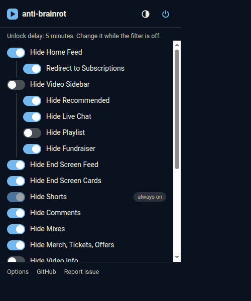
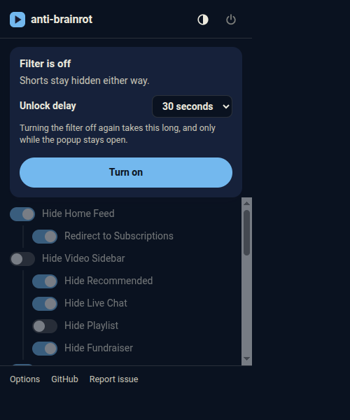
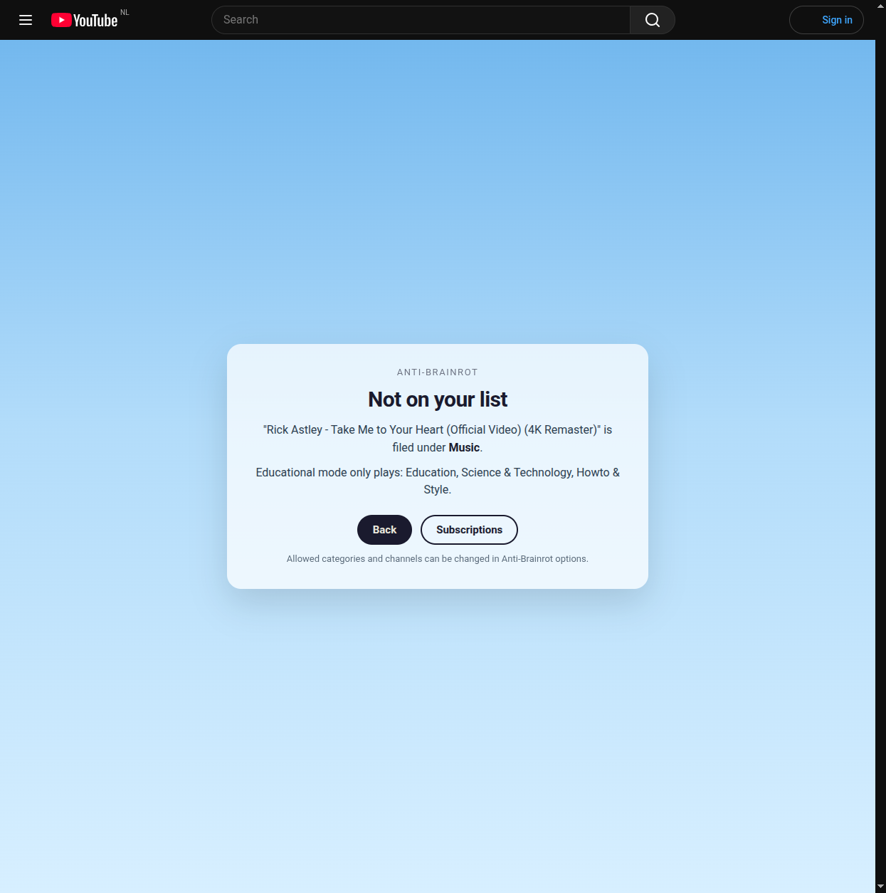

<p align="center">
  
</p>

# anti-brainrot

YouTube without the brain rot. A Chrome extension that removes Shorts for
good, hides feeds and distractions behind a friction timer, can restrict
playback to educational videos, and can keep adult sites out of reach.

It replaces three extensions in one: Remove YouTube Shorts, Youtube-shorts
block, and Unhook. No accounts, no analytics, no network calls of its own.

Website: https://danieltyukov.github.io/anti-brainrot/

## What it does

- **Shorts are gone, always.** Shorts shelves, guide entries, search results
  and notifications are hidden, and any `/shorts/ID` link opens as a normal
  `/watch?v=ID` page. This is not a setting. As long as the extension is
  installed it applies.
- **A filter you configure.** The same toggles Unhook offers: home feed
  (with redirect to Subscriptions), video sidebar and its parts, end screen
  feed and cards, comments, mixes, merch and offers, video info, top header
  and notifications, search shelves, Explore, More from YouTube,
  Subscriptions, autoplay and annotations.
- **A friction timer.** Turning the filter off starts a countdown of a length
  you chose when you turned it on (30 seconds to 1 hour, or instant). The
  countdown only runs while the popup is open. Click away and nothing
  happens. The filter stays on.
- **Tighten any time, loosen only while off.** While the filter is on you can
  add restrictions immediately. Removing one, shortening the delay, allowing
  a category, channel or site all wait until the filter is off.
- **Educational videos only.** Optional. Only videos in the categories you
  allow (default: Education, Science & Technology, Howto & Style) or from
  channels you list can play. Anything else is paused behind a block screen.
- **Adult site blocker.** Optional. A bundled list of 15,000 domains plus
  hostname keyword rules redirect to a block page, everywhere in the
  browser. Add your own sites, or allow false positives, in the options.

<p align="center">
  
  &nbsp;
  
</p>

<p align="center">
  
</p>

## Install

From the Chrome Web Store: coming soon.

From a release:

1. Download `anti-brainrot-<version>.zip` from the
   [latest release](https://github.com/danieltyukov/anti-brainrot/releases/latest)
   and unzip it.
2. Open `chrome://extensions` and switch on Developer mode (top right).
3. Click Load unpacked and pick the unzipped folder (the one that contains
   `manifest.json`).
4. Pin the leaf icon to the toolbar. The filter is on from the first moment.

From source: clone the repository and load the `extension/` folder the same
way. There is no build step.

Chrome 111 or newer, or any Chromium browser with Manifest V3 and
`:has()` support (Edge, Brave, Arc, Vivaldi).

## How the timer works

1. With the filter off, pick an unlock delay in the popup and press Turn on.
2. To turn the filter off, press the power button. A countdown of that
   length starts inside the popup.
3. Keep the popup open until it reaches zero. Closing it, clicking away or
   pressing Keep it on cancels the countdown and the filter stays on.
4. When the countdown ends the filter turns off and every toggle becomes
   editable again.

Shorts blocking is outside the filter and never turns off.

## Educational videos only

YouTube assigns every video one of 15 categories. Anti-Brainrot reads that
category on the watch page (from the page data, or by fetching the watch page
itself when the single-page app has not exposed it yet) and compares it with
your allow list. Videos from allowed channels always play.

Limits worth knowing:

- Feeds and search results still list every video. The gate is the watch
  page. You can search freely; you just cannot watch what is not allowed.
- Category is set by the uploader. Some educational content sits in People &
  Blogs or Entertainment. Add those channels to the allow list.
- A video whose category cannot be read stays blocked (fail closed).

## Adult site blocker

Off by default. Switching it on asks Chrome for permission to act on all
sites (the redirect cannot work otherwise). The list is generated from
public blocklists intersected with the Tranco top million, plus a curated
core, and ships inside the extension. See [docs/BLOCKLIST.md](docs/BLOCKLIST.md)
for sources, licences and how to regenerate it.

Your own entries in the options page are applied as dynamic rules. Allowed
sites win over blocked ones, so a false positive is a one-line fix once the
filter is off.

## Privacy

See [PRIVACY.md](PRIVACY.md). Short version: settings live in
`chrome.storage.sync`, nothing leaves your browser, and the only request the
extension ever makes is a same-origin fetch of a YouTube watch page when
educational mode needs a category the page did not expose.

## Development

```
npm test          # unit tests (Node 20+, no dependencies)
npm run check     # manifest, css attributes, changelog, id consistency
npm run build     # dist/anti-brainrot-<version>.zip
npm run icons     # re-render extension/icons from assets/
npm run blocklist # regenerate extension/rules/adult.json
```

Layout:

```
extension/            the unpacked extension (load this folder)
  lib/                shared plain-script modules on globalThis.AntiBrainrot
  content/            hide.css (attribute-keyed rules), content.js, page-bridge.js
  popup/ options/ blocked/
  rules/              declarativeNetRequest rulesets
assets/               logo and icon sources (SVG)
site/                 the website, deployed to GitHub Pages
scripts/              check, build, icons, blocklist generator
test/                 node --test suites
docs/                 spec, architecture, brand, blocklist, E2E checklist
```

How it works, in one paragraph: `hide.css` is injected at `document_start`
with every rule keyed by a `data-abr-<feature>` attribute on `<html>`.
`content.js` reads the settings and sets those attributes before YouTube
renders, then keeps them in sync with storage changes and YouTube's in-page
navigation. Shorts URLs are rewritten by a declarativeNetRequest rule for
full loads and by the content script for in-page navigation. Educational mode
uses a main-world bridge to read the player response. The adult site list is
a static ruleset that the service worker enables or disables. More in
[docs/ARCHITECTURE.md](docs/ARCHITECTURE.md).

YouTube changes its markup regularly. When something reappears, the fix is
almost always a selector in `extension/content/hide.css`. The E2E checklist
in [docs/E2E.md](docs/E2E.md) records what was verified and when.

## Contributing

Issues and pull requests are welcome. See [CONTRIBUTING.md](CONTRIBUTING.md).

## License

MIT. See [LICENSE](LICENSE). The bundled blocklist has its own sources and
licences, listed in [docs/BLOCKLIST.md](docs/BLOCKLIST.md).
