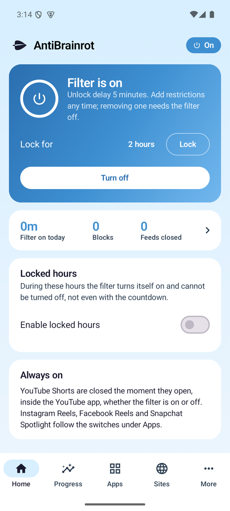
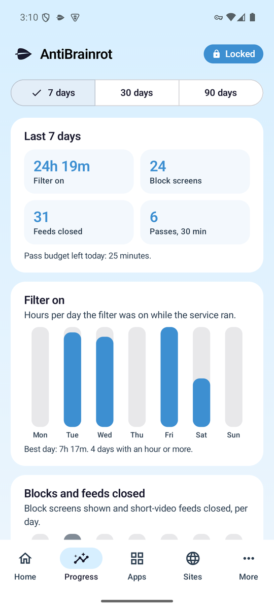
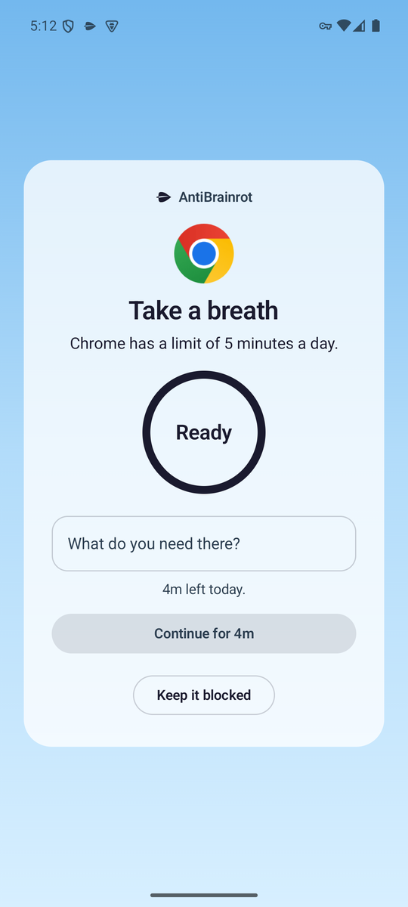

<p align="center">
  <picture>
    <source media="(prefers-color-scheme: dark)" srcset="assets/logo-cream.svg">
    
  </picture>
</p>

# Anti-Brainrot

The anti brain rot extension for Chrome, and an Android app that follows the
same rules. It puts the things that eat your day behind a friction timer:
feeds and Shorts on YouTube, the feeds and short-video surfaces of TikTok,
Instagram, X, Reddit, Facebook and the rest, adult sites, and on the phone
whole apps. Each one is blocked outright or paused with a countdown and a
timed pass, the filter locks itself during your focus hours, and it can be
made hard to remove. No accounts, no analytics, no network calls of its own.

Everything is a setting. The defaults carry an opinion (Shorts hidden, home
feed replaced by Subscriptions, the usual feeds on pause), the timer carries
the friction, and nothing is impossible to change once the filter is off.

Website: https://danieltyukov.github.io/anti-brainrot/

## The idea

- **One switch, the filter.** Every rule below sits under it. Turning it off
  starts a countdown of a length you chose when you turned it on (30 seconds
  to 1 hour, or instant). The countdown only runs while the popup is open.
  Click away and nothing happens. The filter stays on.
- **Tighten any time, loosen only while off.** While the filter is on you can
  add restrictions immediately. Removing one, shortening the delay, allowing
  a site, a category or a channel all wait until the filter is off.
- **Locked hours and locks.** A weekly schedule during which the filter turns
  itself on and cannot be turned off, and a "Lock for N hours" button for
  the moments you know you need it.

## Everywhere in the browser

- **Distracting sites.** Presets for the feed and short-video surfaces of
  TikTok, Instagram, X, Reddit, Facebook, Threads, LinkedIn, Bluesky,
  Tumblr, Pinterest, Twitch, Kick, 9GAG, Imgur, Snapchat and Netflix, plus
  your own patterns and exceptions. In pause mode a countdown and a one-line
  intention stand between you and the site, then you get a timed pass drawn
  from a daily budget, with a cooldown before the next one. In block mode
  they are simply off. In-app navigation is caught too, and the site turns
  grayscale during a pass.
- **Adult sites.** A bundled list of 15,000 domains plus hostname keyword
  rules redirect to a block page. Add your own sites, or allow false
  positives, in the options.
- **Prevent removal.** The browser's extensions page, where the Remove button
  and the on/off switch live, is sent to a block page while the filter is
  on. For the real lock, a browser policy makes Chrome install its own copy
  and refuse to remove or turn it off until the policy file is deleted with
  administrator rights. See [Prevent removal](#prevent-removal).
- **Small nudges.** A reason line you write once and see on every block
  page, a count of today's blocks and passes in the popup, and a warning
  thirty seconds before a pass ends.

## On YouTube

- **Hide Shorts.** On by default. Shorts shelves, guide entries, search
  results and notifications are hidden, and any `/shorts/ID` link opens as
  a normal `/watch?v=ID` page. Like every toggle it goes off with the filter
  and turning it off while the filter is on waits for the countdown.
- **The Unhook toggles.** Home feed (with redirect to Subscriptions), video
  sidebar and its parts, end screen feed and cards, comments, mixes, merch
  and offers, video info, top header and notifications, search shelves,
  Explore, More from YouTube, Subscriptions, History, autoplay and
  annotations.
- **Educational videos only.** Optional. Only videos in the categories you
  allow (default: Education, Science & Technology, Howto & Style) or from
  channels you list can play. Anything else is paused behind a block screen.
- **More options.** Hide or blur thumbnails, hide view counts, likes and
  durations, hide filter chips and the posts, news and games shelves, hide
  search suggestions, or turn YouTube grayscale.

<p align="center">
  
  &nbsp;
  
</p>

<p align="center">
  
</p>

## On the phone

The Android app, AntiBrainrot, is an app and site blocker in the spirit of
AppBlock: every app and every site gets its own rule, blocked outright or a
daily timer, an optional pause before timed ones, an optional block on
installing new apps, adult sites filtered at the DNS level, the friction
timer, locked hours, Lock for N hours, strict mode, Prevent uninstall (the
app becomes a device admin Android refuses to remove), and a Progress tab
with ninety days of counters, charts and a streak. Download
`anti-brainrot-<version>.apk` from the
[latest release](https://github.com/danieltyukov/anti-brainrot/releases/latest),
open it on the phone, allow installing from that source, then follow the
Setup screen. Android 8 or newer. Details, permissions and limits in
[docs/ANDROID.md](docs/ANDROID.md).

<p align="center">
  
  &nbsp;
  
  &nbsp;
  
</p>

## Install the extension

From the Chrome Web Store: coming soon.

From a release:

1. Download `anti-brainrot-<version>.zip` from the
   [latest release](https://github.com/danieltyukov/anti-brainrot/releases/latest)
   and unzip it.
2. Open `chrome://extensions` and switch on Developer mode (top right).
3. Click Load unpacked and pick the unzipped folder (the one that contains
   `manifest.json`).
4. Pin the leaf icon to the toolbar. The filter is on from the first moment.

From source: clone the repository and load the `extension/` folder the same
way. There is no build step.

Chrome 111 or newer, or any Chromium browser with Manifest V3 and
`:has()` support (Edge, Brave, Arc, Vivaldi).

## Prevent removal

Chrome gives an extension no way to protect itself, so this comes in two
layers.

**In the extension.** Switch on Prevent removal in the popup; Chrome asks
for the tabs permission once. While it and the filter are on, any tab at
`chrome://extensions` (and the same page in Edge, Brave, Vivaldi and Opera)
is sent to a block page as soon as it opens, the way strict mode on the
phone leaves App info. Turning it off waits until the filter is off. The
toolbar icon's own "Remove from Chrome" menu still works; that is the door
only a policy can close.

**With a browser policy.** Chrome lets an administrator force-install an
extension. A force-installed extension has no Remove button, no on/off
switch and no toolbar removal, and Chrome keeps it updated by itself. The
policy is one file that needs administrator rights to create and to delete.

On Linux, create `/etc/opt/chrome/policies/managed/anti-brainrot.json`
(for Chromium, `/etc/chromium/policies/managed/`) with:

```json
{
  "ExtensionInstallForcelist": [
    "ibcicobbbpfmonjbhpmllnjgdkedneop;https://danieltyukov.github.io/anti-brainrot/updates.xml"
  ]
}
```

Then restart Chrome, or open `chrome://policy` and click Reload policies.
Chrome downloads the CRX attached to the release that `updates.xml` names,
replaces the copy you loaded unpacked (settings carry over, since they are
keyed by the pinned extension id) and marks it "installed by your
administrator". The options page reports "installed by policy" once that
took effect. To undo, delete the file and restart Chrome; Chrome then
removes the extension.

Windows and macOS honour a force-install of an extension outside the Chrome
Web Store only on a managed machine: joined to a domain, managed by MDM, or
enrolled in Chrome Enterprise Core. On such a machine the same string goes
into the registry under
`HKLM\SOFTWARE\Policies\Google\Chrome\ExtensionInstallForcelist` (Windows)
or the `com.google.Chrome` managed preferences (macOS). Once the extension
is on the Web Store the entry becomes the bare id and works on any machine.

## How the timer works

1. With the filter off, pick an unlock delay in the popup and press Turn on.
2. To turn the filter off, press the power button. A countdown of that
   length starts inside the popup.
3. Keep the popup open until it reaches zero. Closing it, clicking away or
   pressing Keep it on cancels the countdown and the filter stays on.
4. When the countdown ends the filter turns off and every toggle becomes
   editable again.

## Distracting sites

Off by default, switched on from the popup (Chrome asks once for permission
to act on all sites, because a redirect rule cannot work otherwise). Pick
the presets in the options, add your own patterns (`site.com` for the whole
site, `site.com/` for its front page only, `site.com/path` for everything
under a path) and exceptions that stay open inside a blocked site, such as
`reddit.com/r/programming`.

Pause mode: a countdown you sit through (it restarts if you switch tabs), a
short intention if you want it, then "Continue for 5 minutes". Passes are
charged up front against a daily budget, and after a pass ends the same site
cools down before it offers another. Block mode skips all of that. Full
page loads are handled by declarative rules before any request is made;
in-app navigation is caught by a small watcher that only runs on the
enabled hosts.

## Adult site blocker

Off by default, same one-time permission. The list is generated from public
blocklists intersected with the Tranco top million, plus a curated core, and
ships inside the extension. See [docs/BLOCKLIST.md](docs/BLOCKLIST.md) for
sources, licences and how to regenerate it.

Your own entries in the options page are applied as dynamic rules. Allowed
sites win over blocked ones, so a false positive is a one-line fix once the
filter is off.

## Locked hours

Set days and a window in the options and switch on Locked hours. During the
window the filter turns itself on within a minute and the power button is
disabled; not even the countdown can turn it off. "Lock for N hours" in the
popup does the same for an ad hoc stretch. Both are subject to the usual
rule: widening a lock is immediate, narrowing it waits until the filter is
off.

## Educational videos only

YouTube assigns every video one of 15 categories. Anti-Brainrot reads that
category on the watch page (from the page data, or by fetching the watch page
itself when the single-page app has not exposed it yet) and compares it with
your allow list. Videos from allowed channels always play.

Limits worth knowing:

- Feeds and search results still list every video. The gate is the watch
  page. You can search freely; you just cannot watch what is not allowed.
- Category is set by the uploader. Some educational content sits in People &
  Blogs or Entertainment. Add those channels to the allow list.
- A video whose category cannot be read stays blocked (fail closed).

## Privacy

See [PRIVACY.md](PRIVACY.md). Short version: settings live in
`chrome.storage.sync`, nothing leaves your browser, and the only request the
extension ever makes is a same-origin fetch of a YouTube watch page when
educational mode needs a category the page did not expose.

## Development

```
npm test          # unit tests (Node 20+, no dependencies)
npm run check     # manifest, css attributes, changelog, update manifest, id consistency
npm run build     # dist/anti-brainrot-<version>.zip, plus the .crx when the signing key is present
npm run icons     # re-render extension/icons from assets/
npm run blocklist # regenerate extension/rules/adult.json
```

Layout:

```
extension/            the unpacked extension (load this folder)
  lib/                shared plain-script modules on globalThis.AntiBrainrot
  content/            hide.css (attribute-keyed rules), content.js, page-bridge.js,
                      distractions.js and distractions-main.js (registered on demand)
  popup/ options/ blocked/
  rules/              declarativeNetRequest rulesets
android/              the Android app (Kotlin, Jetpack Compose); see docs/ANDROID.md
assets/               logo and icon sources (SVG)
site/                 the website and updates.xml, deployed to GitHub Pages
scripts/              check, build, pack-crx, icons, blocklist generator
test/                 node --test suites
docs/                 spec, plan, architecture, brand, blocklist, research, E2E checklist
```

How it works, in one paragraph: `hide.css` is injected at `document_start`
with every rule keyed by a `data-abr-<feature>` attribute on `<html>`.
`content.js` reads the settings and sets those attributes before YouTube
renders, then keeps them in sync with storage changes and YouTube's in-page
navigation. Shorts URLs are rewritten by a declarativeNetRequest rule for
full loads and by the content script for in-page navigation, both following
the Hide Shorts toggle. Educational mode uses a main-world bridge to read the
player response. The adult site list is a static ruleset that the service
worker enables or disables. The removal guard watches tab URLs with the
optional tabs permission. More in [docs/ARCHITECTURE.md](docs/ARCHITECTURE.md).

YouTube changes its markup regularly. When something reappears, the fix is
almost always a selector in `extension/content/hide.css`. The E2E checklist
in [docs/E2E.md](docs/E2E.md) records what was verified and when.

## Contributing

Issues and pull requests are welcome. See [CONTRIBUTING.md](CONTRIBUTING.md).

## License

MIT. See [LICENSE](LICENSE). The bundled blocklist has its own sources and
licences, listed in [docs/BLOCKLIST.md](docs/BLOCKLIST.md).
